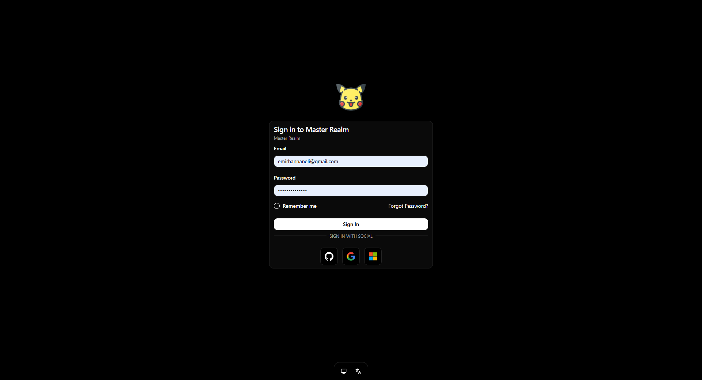
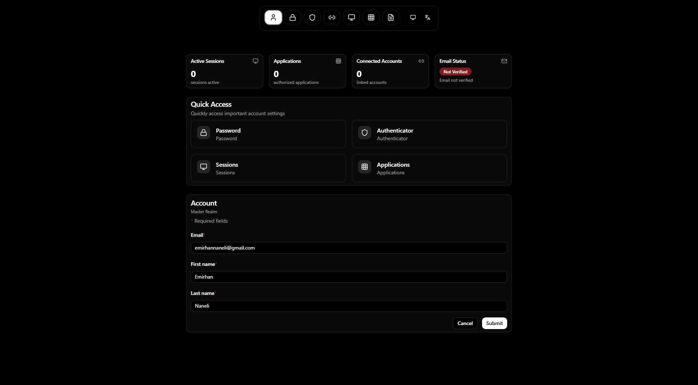

<p align="center">
    
    <br/>
    <i>🚀 <a href="https://keycloakify.dev">Keycloakify</a> v11 Starter with shadcn/ui 🚀</i>
    <br/>
    <br/>
    <a href="https://keycloakify.dev">Documentation</a> •
    <a href="https://github.com/keycloakify/keycloakify-starter">GitHub</a>
</p>

---

# Keycloakify Starter

A modern, production-ready starter template for building custom Keycloak themes using **Keycloakify v11**, **React 18**, **TypeScript**, and **shadcn/ui** components. This starter provides a beautiful, accessible, and fully customizable authentication experience for Keycloak.

<p align="center">
    
</p>

<p align="center">
    
</p>

## ✨ Features

- 🎨 **Modern UI** - Built with shadcn/ui components and Tailwind CSS
- ⚡ **Fast Development** - Powered by Vite for lightning-fast builds
- 🔒 **Type-Safe** - Full TypeScript support with strict type checking
- 🧩 **Component-Based** - Reusable UI components built on Radix UI primitives
- 📱 **Responsive** - Mobile-first design that works on all devices
- ♿ **Accessible** - WCAG compliant components out of the box
- 🎭 **Storybook** - Visual component development and testing
- 🔧 **Customizable** - Easy to customize and extend
- 📦 **Production Ready** - Optimized builds with code splitting
- 🌍 **Multi-Language Support** - Built-in i18n with 21 languages for Account and 28 languages for Login themes
- 🔤 **Translation Management** - Automated scripts for generating and fixing translations

## 🎯 Customized Pages

This starter includes **21 fully customized pages** with modern UI components:

### Authentication Pages
- ✅ **Login** - User authentication with username/email and password
- ✅ **Register** - User registration with profile fields
- ✅ **Reset Password** - Password reset request
- ✅ **Update Password** - Password update during login flow
- ✅ **Username** - Username input for two-step authentication
- ✅ **Password** - Password input for two-step authentication
- ✅ **OTP** - One-Time Password authentication
- ✅ **TOTP Configuration** - TOTP setup with QR code
- ✅ **Verify Email** - Email verification page
- ✅ **Update Profile** - Profile update during login flow

### System Pages
- ✅ **Error** - Error display page
- ✅ **Info** - Information and action messages
- ✅ **Terms** - Terms and conditions acceptance
- ✅ **Logout Confirm** - Logout confirmation dialog

### Account Management Pages
- ✅ **Account** - User account overview and profile management
- ✅ **Applications** - Manage authorized OAuth applications and permissions
- ✅ **Federated Identity** - Manage social identity provider connections
- ✅ **Password** - Change account password
- ✅ **Sessions** - View and manage active sessions
- ✅ **TOTP** - Configure two-factor authentication with TOTP
- ✅ **Log** - View account activity and security logs

## 🚀 Quick Start

### Prerequisites

- **Node.js** >= 18.0.0 or >= 20.0.0
- **npm**, **yarn**, or **pnpm** package manager
- **Maven** >= 3.1.1 (for building the theme)
- **Java** >= 7 (for Maven)

### Installation

```bash
# Clone the repository
git clone https://github.com/emirhannaneli/keycloak-shadcn
cd keycloak-shadcn

# Install dependencies
yarn install
# or
npm install
# or
pnpm install
```

> **Note:** If you use a different package manager, make sure to delete the `yarn.lock` file.

### Install Maven (if needed)

- **macOS:** `brew install maven`
- **Debian/Ubuntu:** `sudo apt-get install maven`
- **Windows:** 
  - Using Chocolatey: `choco install openjdk` and `choco install maven`
  - Or download from [Maven website](https://maven.apache.org/download.cgi)

## 🛠️ Development

### Start Development Server

```bash
yarn dev
# or
npm run dev
```

The development server will start at `http://localhost:5173` (or the next available port).

### Testing Pages Locally

To test specific pages during development, uncomment the mock context in `src/main.tsx`:

```typescript
import { getKcContextMock } from "./login/KcPageStory";

if (import.meta.env.DEV) {
    window.kcContext = getKcContextMock({
        pageId: "login.ftl", // Change to test different pages
        overrides: {}
    });
}
```

For more information, see the [Keycloakify documentation on testing](https://docs.keycloakify.dev/testing-your-theme).

### Storybook

Start Storybook to visually develop and test components:

```bash
yarn storybook
# or
npm run storybook
```

Storybook will be available at `http://localhost:6006`.

## 🎨 Customization

### UI Components

This starter uses **shadcn/ui** components built on **Radix UI** primitives. All components are located in `src/components/ui/` and can be customized to match your brand.

### Styling

- **Tailwind CSS** - Utility-first CSS framework
- **CSS Variables** - Theme customization via CSS variables
- **Base Color:** Slate (configurable in `components.json`)

### Customization Strategies

For detailed customization guides, see the [Keycloakify customization documentation](https://docs.keycloakify.dev/customization-strategies).

### Adding New Pages

1. Create a new page component in `src/login/pages/`
2. Add the route in `src/kc.gen.tsx`
3. Customize the page using shadcn/ui components

## 🌍 Multi-Language Support (i18n)

This starter includes comprehensive internationalization support with automated translation management.

### Supported Languages

**Account Theme (21 languages):**
- Arabic (ar), Catalan (ca), Czech (cs), Danish (da), German (de), Spanish (es), Finnish (fi), French (fr), Hungarian (hu), Italian (it), Japanese (ja), Lithuanian (lt), Latvian (lv), Dutch (nl), Norwegian (no), Polish (pl), Portuguese (pt-BR), Russian (ru), Slovak (sk), Swedish (sv), Chinese Simplified (zh-CN)

**Login Theme (28 languages):**
- All Account languages plus: Greek (el), Persian (fa), Georgian (ka), Portuguese (pt), Thai (th), Ukrainian (uk), Chinese Traditional (zh-TW)

### Translation Management Scripts

The project includes automated scripts for managing translations:

#### Generate Translations
Generate translation files from Keycloakify default messages:

```bash
node scripts/generate-translations.js
```

#### Fix Translations
Fix and update existing translation files:

```bash
node scripts/fix-translations.js
```

#### Update i18n Configuration
Update the i18n configuration files after adding new languages:

```bash
node scripts/update-i18n.js
```

### Adding Custom Translations

1. Edit translation files in `src/account/messages/` or `src/login/messages/`
2. Add new language files following the existing pattern
3. Run `node scripts/update-i18n.js` to update the i18n configuration
4. Translations are automatically integrated via the `useI18n` hook

## 📦 Building the Theme

Build the Keycloak theme JAR files:

```bash
yarn build-keycloak-theme
# or
npm run build-keycloak-theme
```

This command will:
1. Build the React application
2. Generate Keycloak theme JAR files in `dist_keycloak/`

By default, Keycloakify generates multiple JAR files for different Keycloak versions:
- `keycloak-theme-for-kc-22-to-25.jar` - For Keycloak 22-25
- `keycloak-theme-for-kc-all-other-versions.jar` - For other versions

You can customize this behavior. See the [Keycloak version targets documentation](https://docs.keycloakify.dev/features/compiler-options/keycloakversiontargets).

## 🔧 Additional Themes

### Account Theme

Initialize the account theme (for the account management console):

```bash
npx keycloakify initialize-account-theme
```

### Email Theme

Initialize the email theme (for email templates):

```bash
npx keycloakify initialize-email-theme
```

## 🚢 Deployment

### Manual Deployment

1. Build the theme: `yarn build-keycloak-theme`
2. Upload the JAR files from `dist_keycloak/` to your Keycloak instance
3. Enable the theme in Keycloak Admin Console

### GitHub Actions

This starter includes a GitHub Actions workflow that automatically:
- Builds the theme on version updates
- Publishes JAR files as GitHub release artifacts

To enable the workflow:
1. Go to your repository on GitHub
2. Navigate to `Settings` > `Actions` > `Workflow permissions`
3. Select `Read and write permissions`

To release a new version, simply update the `version` field in `package.json` and push to the repository.

## 📚 Tech Stack

- **Framework:** React 18
- **Language:** TypeScript 5
- **Build Tool:** Vite 5
- **UI Components:** shadcn/ui (Radix UI)
- **Styling:** Tailwind CSS 3
- **Forms:** React Hook Form + Zod
- **Icons:** Lucide React
- **Theme Builder:** Keycloakify v11
- **Internationalization:** Keycloakify i18n with 21-28 language support

## 📖 Documentation

- [Keycloakify Documentation](https://docs.keycloakify.dev)
- [shadcn/ui Documentation](https://ui.shadcn.com)
- [Tailwind CSS Documentation](https://tailwindcss.com)
- [React Documentation](https://react.dev)

## 🤝 Contributing

Contributions are welcome! Please feel free to submit a Pull Request.

## 📄 License

This project is licensed under the MIT License.

## 🙏 Acknowledgments

- [Keycloakify](https://keycloakify.dev) - For the amazing theme building tool
- [shadcn/ui](https://ui.shadcn.com) - For the beautiful component library
- [Radix UI](https://www.radix-ui.com) - For accessible component primitives

---

<p align="center">
    Made with ❤️ using Keycloakify
</p>
