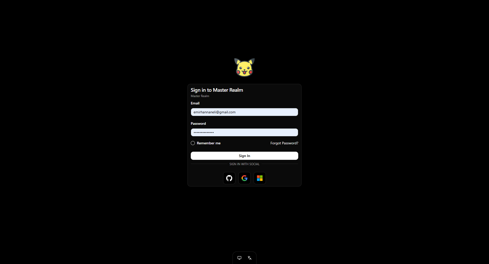
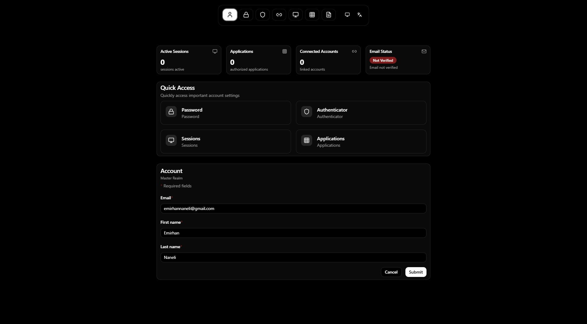

<p align="center">
    
    <br/>
    <i>🚀 <a href="https://keycloakify.dev">Keycloakify</a> v11 Starter with shadcn/ui 🚀</i>
    <br/>
    <br/>
    <a href="https://keycloakify.dev">Documentation</a> •
    <a href="https://github.com/keycloakify/keycloakify-starter">GitHub</a>
</p>

---

# Keycloakify Starter

A modern, production-ready starter template for building custom Keycloak themes using **Keycloakify v11**, **React 18**, **TypeScript**, and **shadcn/ui** components. This starter provides a beautiful, accessible, and fully customizable authentication experience for Keycloak.

<p align="center">
    
</p>

<p align="center">
    
</p>

## ✨ Features

- 🎨 **Modern UI** - Built with shadcn/ui components and Tailwind CSS
- ⚡ **Fast Development** - Powered by Vite for lightning-fast builds
- 🔒 **Type-Safe** - Full TypeScript support with strict type checking
- 🧩 **Component-Based** - Reusable UI components built on Radix UI primitives
- 📱 **Responsive** - Mobile-first design that works on all devices
- ♿ **Accessible** - WCAG compliant components out of the box
- 🎭 **Storybook** - Visual component development and testing
- 🔧 **Customizable** - Easy to customize and extend
- 📦 **Production Ready** - Optimized builds with code splitting
- 🌍 **Multi-Language Support** - Built-in i18n with 21 languages for Account and 28 languages for Login themes
- 🔤 **Translation Management** - Automated scripts for generating and fixing translations
- 🖼️ **Dynamic Logo** - Change login logo dynamically via Keycloak Admin Console without rebuilding the theme

## 🎯 Customized Pages

This starter includes **21 fully customized pages** with modern UI components:

### Authentication Pages
- ✅ **Login** - User authentication with username/email and password
- ✅ **Register** - User registration with profile fields
- ✅ **Reset Password** - Password reset request
- ✅ **Update Password** - Password update during login flow
- ✅ **Username** - Username input for two-step authentication
- ✅ **Password** - Password input for two-step authentication
- ✅ **OTP** - One-Time Password authentication
- ✅ **TOTP Configuration** - TOTP setup with QR code
- ✅ **Verify Email** - Email verification page
- ✅ **Update Profile** - Profile update during login flow

### System Pages
- ✅ **Error** - Error display page
- ✅ **Info** - Information and action messages
- ✅ **Terms** - Terms and conditions acceptance
- ✅ **Logout Confirm** - Logout confirmation dialog

### Account Management Pages
- ✅ **Account** - User account overview and profile management
- ✅ **Applications** - Manage authorized OAuth applications and permissions
- ✅ **Federated Identity** - Manage social identity provider connections
- ✅ **Password** - Change account password
- ✅ **Sessions** - View and manage active sessions
- ✅ **TOTP** - Configure two-factor authentication with TOTP
- ✅ **Log** - View account activity and security logs

## 🚀 Quick Start

### Prerequisites

- **Node.js** >= 18.0.0 or >= 20.0.0
- **npm**, **yarn**, **pnpm**, or **bun** package manager
- **Maven** >= 3.1.1 (for building the theme)
- **Java** >= 7 (for Maven)

### Installation

```bash
# Clone the repository
git clone https://github.com/emirhannaneli/keycloak-shadcn
cd keycloak-shadcn

# Install dependencies
yarn install
# or
npm install
# or
pnpm install
# or
bun install
```

> **Note:** If you use a different package manager, make sure to delete the `bun.lock` file.

### Install Maven (if needed)

- **macOS:** `brew install maven`
- **Debian/Ubuntu:** `sudo apt-get install maven`
- **Windows:** 
  - Using Chocolatey: `choco install openjdk` and `choco install maven`
  - Or download from [Maven website](https://maven.apache.org/download.cgi)

## 🛠️ Development

### Start Development Server

```bash
yarn dev
# or
npm run dev
# or
bun run dev
```

The development server will start at `http://localhost:5173` (or the next available port).

### Testing Pages Locally

To test specific pages during development, uncomment the mock context in `src/main.tsx`:

```typescript
import { getKcContextMock } from "./login/KcPageStory";

if (import.meta.env.DEV) {
    window.kcContext = getKcContextMock({
        pageId: "login.ftl", // Change to test different pages
        overrides: {}
    });
}
```

For more information, see the [Keycloakify documentation on testing](https://docs.keycloakify.dev/testing-your-theme).

### Storybook

Start Storybook to visually develop and test components:

```bash
yarn storybook
# or
npm run storybook
# or
bun run storybook
```

Storybook will be available at `http://localhost:6006`.

## 🎨 Customization

### Theme Name Configuration

The theme name can be customized in `src/config.ts`. This name will be used for:
- The artifact ID in the generated JAR files
- The JAR file names for different Keycloak versions

To customize the theme name:

1. Open `src/config.ts`
2. Update the `themeName` property:

```typescript
export const keycloakThemeConfig = {
    themeName: "my-custom-theme", // Change this to your desired theme name
} as const;
```

3. **Important:** Also update the project name in `package.json` to match your theme name:

```json
{
  "name": "my-custom-theme",
  ...
}
```

> **Note:** It's recommended to keep the `package.json` name and `src/config.ts` theme name consistent for better project organization.

The JAR file names will automatically be generated based on this theme name. For example, with `themeName: "my-custom-theme"`, the generated files will be:
- `my-custom-theme-26.2-and-above.jar`
- `my-custom-theme-26.0-to-26.1.jar`
- `my-custom-theme-25.jar`
- And so on...

### UI Components

This starter uses **shadcn/ui** components built on **Radix UI** primitives. All components are located in `src/components/ui/` and can be customized to match your brand.

### Styling

- **Tailwind CSS** - Utility-first CSS framework
- **CSS Variables** - Theme customization via CSS variables
- **Base Color:** Slate (configurable in `components.json`)

### Dynamic Logo & Favicon Configuration

The theme reads per-realm branding from realm attributes (`theme.logoLight`, `theme.logoDark`, `theme.faviconUrl`). You can edit these in two ways:

#### Option A — Admin Console UI (Phase 2)

A "Theme Config" tab appears under **Realm Settings** in the Keycloak admin console. Three text inputs: light logo URL, dark logo URL, favicon URL. Validation is light (URL-shape check); blank fields clear the attribute and fall back to the bundled default.

**Prerequisites:**

1. Keycloak must start with the experimental feature flag enabled:

   ```bash
   # Docker (dev mode):
   docker run -p 8080:8080 \
     -e KEYCLOAK_ADMIN=admin -e KEYCLOAK_ADMIN_PASSWORD=admin \
     -v "$(pwd)/dist_keycloak:/opt/keycloak/providers" \
     quay.io/keycloak/keycloak:26.0 \
     start-dev --features=declarative-ui

   # Local install (production):
   bin/kc.sh build --features=declarative-ui
   bin/kc.sh start
   ```

2. Deploy the SPI JAR (`dist_keycloak/theme-config-spi.jar`) into Keycloak's `providers/` directory alongside the theme JAR matching your Keycloak version. Restart Keycloak.

3. Open Admin Console → Realm Settings → "Theme Config" tab. Fill in URLs, save.

**Caveats:**

- The `declarative-ui` feature is marked experimental by Keycloak. It may change without notice in future Keycloak versions.
- Keycloak **26.2.x has a regression** ([keycloak#39971](https://github.com/keycloak/keycloak/issues/39971)) that hides custom UI tabs. Use Option B or upgrade to 26.3.x+.
- The form stores values in a Keycloak `ComponentModel` and mirrors them to `realm.attributes`. If you edit attributes via REST first and then open the UI, the form shows empty until you save once — **pick one workflow, UI or REST, not both**.

#### Option B — Admin REST API

The Phase 1 workflow remains available. Set the realm attributes directly via Keycloak's admin REST API — no feature flag needed:

```bash
TOKEN=$(curl -s -X POST http://localhost:8080/realms/master/protocol/openid-connect/token \
  -d "client_id=admin-cli" -d "username=admin" -d "password=admin" \
  -d "grant_type=password" | jq -r .access_token)

curl -X PATCH http://localhost:8080/admin/realms/<your-realm> \
  -H "Authorization: Bearer $TOKEN" \
  -H "Content-Type: application/json" \
  -d '{
    "attributes": {
      "theme.logoLight": "https://cdn.example.com/logo.png",
      "theme.logoDark":  "https://cdn.example.com/logo-dark.png",
      "theme.faviconUrl": "https://cdn.example.com/favicon.ico"
    }
  }'
```

Verify: `curl http://localhost:8080/realms/<your-realm>/theme-config` returns the JSON without the `theme.` prefix.

#### Supported keys

| Attribute | Purpose |
|---|---|
| `theme.logoLight` | Logo shown in light mode |
| `theme.logoDark` | Logo shown in dark mode (falls back to `logoLight` if absent) |
| `theme.faviconUrl` | Browser tab icon |

Any other `theme.*` attribute is also exposed on the endpoint (without the prefix), but only these three are surfaced as inputs in Option A's UI.

#### Building the SPI

The `npm run build-keycloak-theme` script invokes the bundled Apache Maven Wrapper (`./mvnw` / `mvnw.cmd`), so no system Maven install is required. First invocation downloads Maven 3.9.16 into `~/.m2/wrapper/dists/` (~30 seconds). Subsequent builds reuse the cached Maven. Deploy **only the theme JAR matching your Keycloak version** (e.g. `keycloak-shadcn-26.0-to-26.1.jar` for Keycloak 26.0.x / 26.1.x), together with `theme-config-spi.jar`. Deploying multiple version JARs together causes Keycloak to pick an ambiguous parent-theme chain.

#### Legacy: Display name HTML

You can still configure the logo via `Realm Settings → General → Display name HTML`. Either paste a bare URL (taken as `logo-light`) or use the HTML comment form:

```html
<!--logo-light:https://cdn.example.com/logo.png-->
<!--logo-dark:https://cdn.example.com/logo-dark.png-->
<!--favicon:https://cdn.example.com/favicon.ico-->
```

This mechanism is preserved for backward compatibility. New deployments should use Option A or B above.

#### Fallback behaviour

If neither source provides a value, or a URL fails to load, the bundled defaults (`img/keycloak-logo-text.png`, `public/favicon-32x32.png`) are used. Pages never block on a missing logo.

### Customization Strategies

For detailed customization guides, see the [Keycloakify customization documentation](https://docs.keycloakify.dev/customization-strategies).

### Adding New Pages

1. Create a new page component in `src/login/pages/`
2. Add the route in `src/kc.gen.tsx`
3. Customize the page using shadcn/ui components

## 🌍 Multi-Language Support (i18n)

This starter includes comprehensive internationalization support with automated translation management.

### Supported Languages

**Account Theme (21 languages):**
- Arabic (ar), Catalan (ca), Czech (cs), Danish (da), German (de), Spanish (es), Finnish (fi), French (fr), Hungarian (hu), Italian (it), Japanese (ja), Lithuanian (lt), Latvian (lv), Dutch (nl), Norwegian (no), Polish (pl), Portuguese (pt-BR), Russian (ru), Slovak (sk), Swedish (sv), Chinese Simplified (zh-CN)

**Login Theme (28 languages):**
- All Account languages plus: Greek (el), Persian (fa), Georgian (ka), Portuguese (pt), Thai (th), Ukrainian (uk), Chinese Traditional (zh-TW)

### Translation Management Scripts

The project includes automated scripts for managing translations:

#### Generate Translations
Generate translation files from Keycloakify default messages:

```bash
node scripts/generate-translations.js
```

#### Fix Translations
Fix and update existing translation files:

```bash
node scripts/fix-translations.js
```

#### Update i18n Configuration
Update the i18n configuration files after adding new languages:

```bash
node scripts/update-i18n.js
```

### Adding Custom Translations

1. Edit translation files in `src/account/messages/` or `src/login/messages/`
2. Add new language files following the existing pattern
3. Run `node scripts/update-i18n.js` to update the i18n configuration
4. Translations are automatically integrated via the `useI18n` hook

## 📦 Building the Theme

Build the Keycloak theme JAR files:

```bash
yarn build-keycloak-theme
# or
npm run build-keycloak-theme
# or
bun run build-keycloak-theme
```

This command will:
1. Build the React application
2. Generate Keycloak theme JAR files in `dist_keycloak/`

The theme generates multiple JAR files for different Keycloak versions. The JAR file names are automatically generated based on the theme name configured in `src/config.ts`. By default, the following JAR files are generated:

- `keycloak-shadcn-26.2-and-above.jar` - For Keycloak 26.2 and above
- `keycloak-shadcn-26.0-to-26.1.jar` - For Keycloak 26.0 to 26.1
- `keycloak-shadcn-25.jar` - For Keycloak 25
- `keycloak-shadcn-24.jar` - For Keycloak 24
- `keycloak-shadcn-23.jar` - For Keycloak 23
- `keycloak-shadcn-21-and-below.jar` - For Keycloak 21 and below

> **Note:** To customize the theme name and JAR file names, edit the `themeName` property in `src/config.ts`. See the [Theme Name Configuration](#theme-name-configuration) section above.

### Important: After Changing Theme Name

If you change the theme name in `src/config.ts` and the new theme name doesn't appear in Keycloak after deployment, follow these steps:

1. **Clean build**: Delete the `dist` and `dist_keycloak` folders before rebuilding:
   ```bash
   rm -rf dist dist_keycloak
   # or on Windows:
   rmdir /s /q dist dist_keycloak
   ```

2. **Rebuild**: Run the build command again:
   ```bash
   yarn build-keycloak-theme
   ```

3. **Remove old JAR**: Remove the old JAR file from Keycloak's `providers/` directory before uploading the new one.

4. **Restart Keycloak**: After uploading the new JAR file, restart Keycloak to clear the theme cache:
   ```bash
   # Stop Keycloak
   bin/kc.sh stop
   # Start Keycloak
   bin/kc.sh start
   ```

5. **Clear theme cache** (optional): If the theme still doesn't update, clear Keycloak's theme cache:
   ```bash
   # Delete the cache directory
   rm -rf data/tmp/kc-gzip-cache
   # or start Keycloak with cache disabled:
   bin/kc.sh start --spi-theme-cache-themes=false --spi-theme-cache-templates=false
   ```

6. **Select the theme**: In Keycloak Admin Console, go to your realm's settings and select the new theme name from the theme dropdown.

The `artifactId` parameter in `vite.config.ts` uses the theme name from `src/config.ts` and sets both the JAR file name and the theme name inside the JAR file. If the theme name doesn't change, it's usually due to caching or an incomplete rebuild.

For more information about Keycloak version targets, see the [Keycloak version targets documentation](https://docs.keycloakify.dev/features/compiler-options/keycloakversiontargets).

## 🔧 Additional Themes

### Account Theme

Initialize the account theme (for the account management console):

```bash
npx keycloakify initialize-account-theme
```

### Email Theme

Initialize the email theme (for email templates):

```bash
npx keycloakify initialize-email-theme
```

## 🚢 Deployment

### Manual Deployment

1. Build the theme: `yarn build-keycloak-theme`
2. Upload the JAR files from `dist_keycloak/` to your Keycloak instance
3. Enable the theme in Keycloak Admin Console

### GitHub Actions

This starter includes a GitHub Actions workflow that automatically:
- Builds the theme on version updates
- Publishes JAR files as GitHub release artifacts

To enable the workflow:
1. Go to your repository on GitHub
2. Navigate to `Settings` > `Actions` > `Workflow permissions`
3. Select `Read and write permissions`

To release a new version, simply update the `version` field in `package.json` and push to the repository.

## 📚 Tech Stack

- **Framework:** React 18
- **Language:** TypeScript 5
- **Build Tool:** Vite 5
- **UI Components:** shadcn/ui (Radix UI)
- **Styling:** Tailwind CSS 3
- **Forms:** React Hook Form + Zod
- **Icons:** Lucide React
- **Theme Builder:** Keycloakify v11
- **Internationalization:** Keycloakify i18n with 21-28 language support

## 📖 Documentation

- [Keycloakify Documentation](https://docs.keycloakify.dev)
- [shadcn/ui Documentation](https://ui.shadcn.com)
- [Tailwind CSS Documentation](https://tailwindcss.com)
- [React Documentation](https://react.dev)

## 🤝 Contributing

Contributions are welcome! Please feel free to submit a Pull Request.

## 📄 License

This project is licensed under the MIT License.

## 🙏 Acknowledgments

- [Keycloakify](https://keycloakify.dev) - For the amazing theme building tool
- [shadcn/ui](https://ui.shadcn.com) - For the beautiful component library
- [Radix UI](https://www.radix-ui.com) - For accessible component primitives

---

<p align="center">
    Made with ❤️ using Keycloakify
</p>
